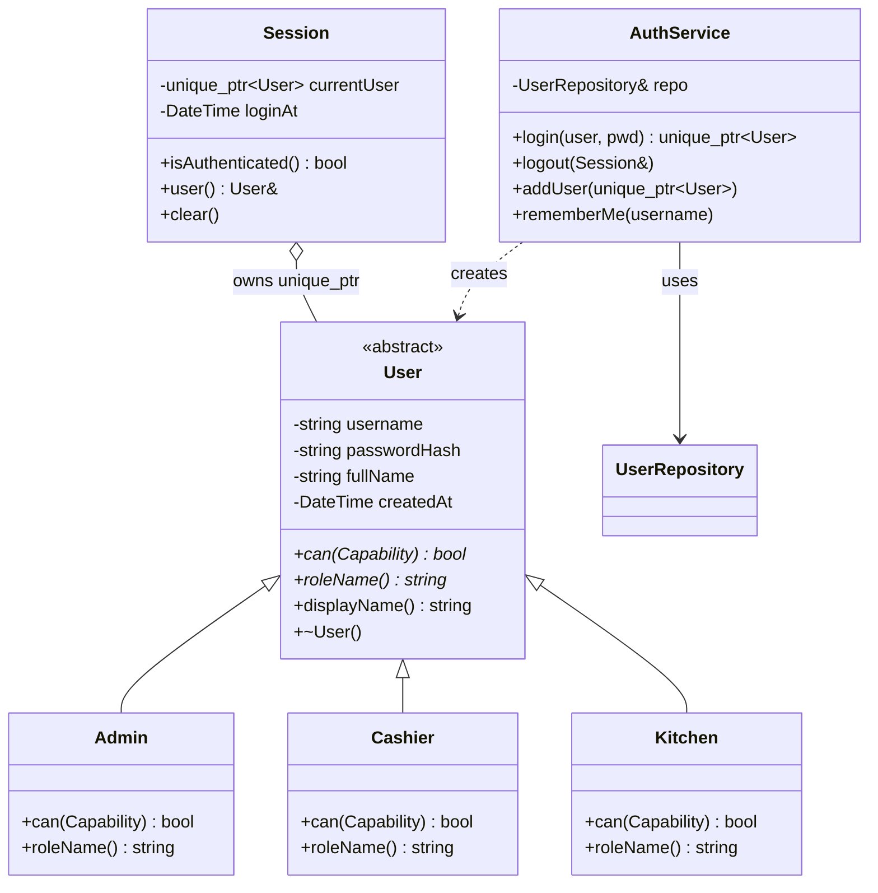
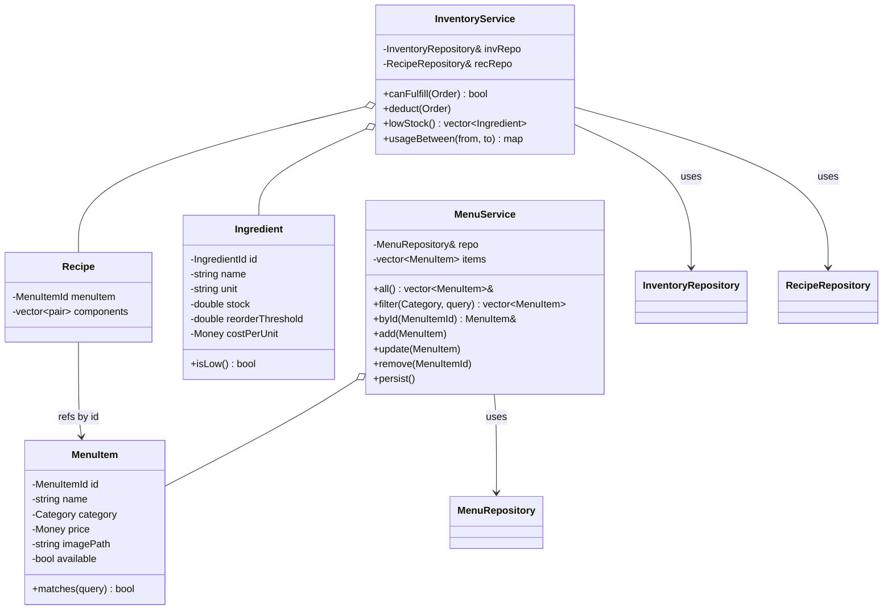
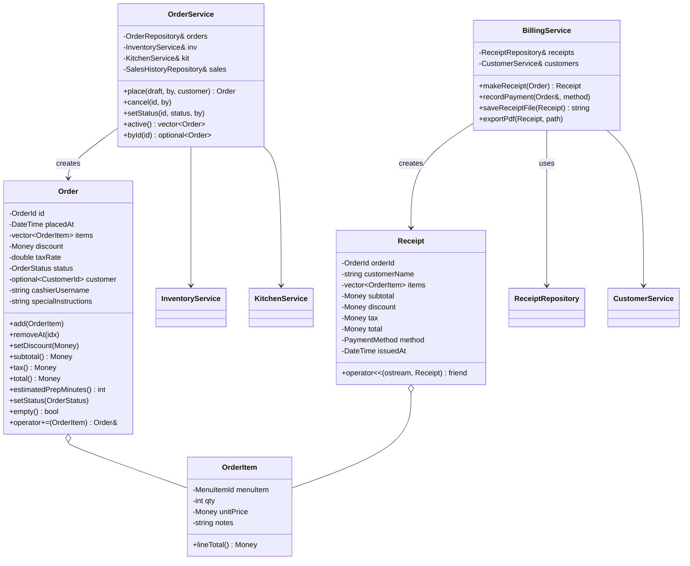
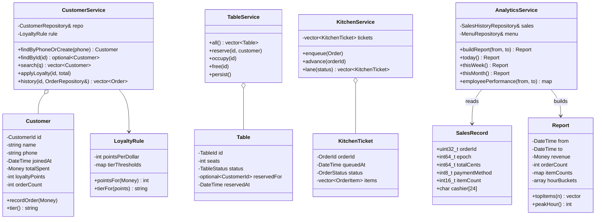
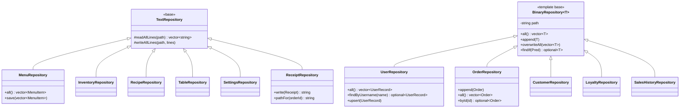
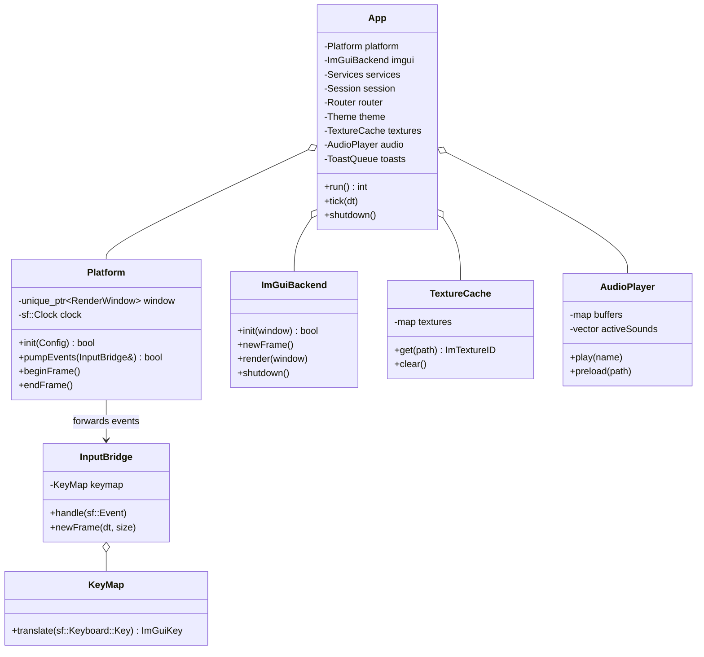
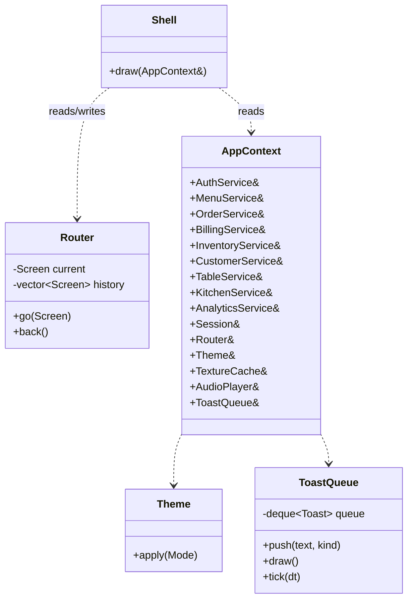
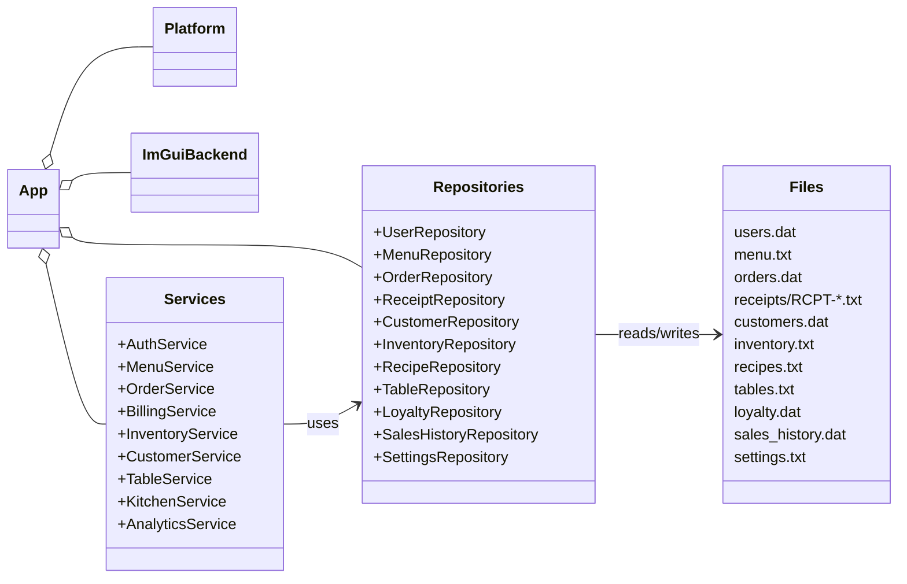

# 05 — UML Class Diagrams (Mermaid)

> Phase 1 planning document. All diagrams are in Mermaid `classDiagram` syntax so they
> render directly in GitHub / VS Code / Obsidian without any extra tooling.
> Several smaller diagrams are easier to read than one mega-diagram, so this file
> splits by domain package and finishes with an overview.

---

## 1. Auth package

---

## 2. Menu + Inventory packages

---

## 3. Order + Billing packages

---

## 4. Customer + Tables + Kitchen + Analytics

---

## 5. Persistence (the template demo)

---

## 6. Platform / integration layer

---

## 7. UI layer skeleton

UI screens are intentionally *not* classes — they are free functions in
`ui::screens::Draw*`. They appear in `07-data-flow.md` and `09-gui-wireframes.md`
instead of in the class diagram.

---

## 8. End-to-end overview (services + ownership)

---

*End of `05-uml-diagrams.md`.*
