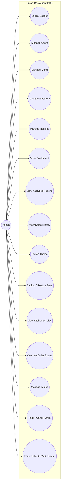
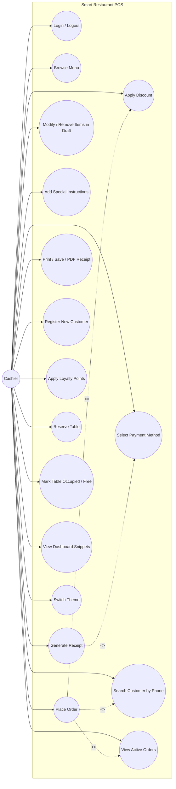
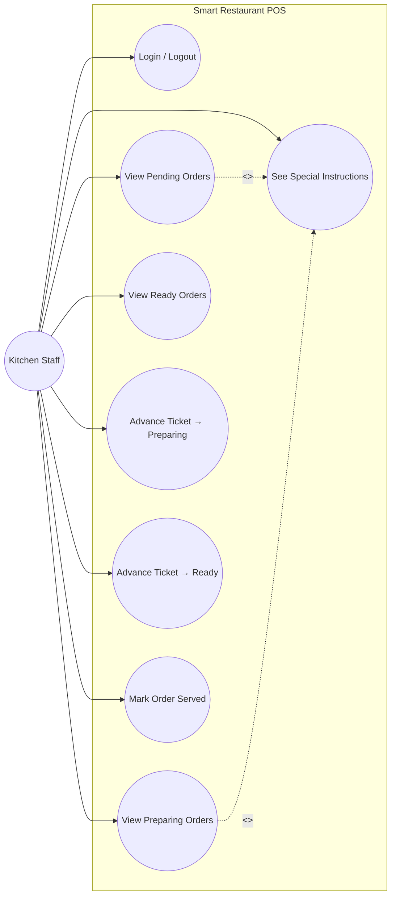
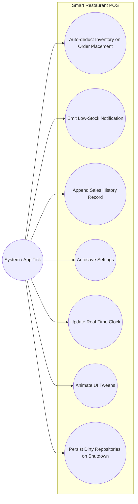
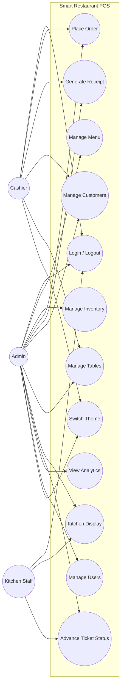

# 06 — Use-Case Diagrams (Mermaid)

> Phase 1 planning document. Mermaid has no first-class UML use-case syntax, so we use
> `flowchart LR` with circular nodes for use cases (the closest visual match) and
> `subgraph "System"` to enclose them. One diagram per actor, then a combined view.

---

## 1. Actors and their authority (summary)

| Actor | Authority |
|---|---|
| **Admin** | Full system access — manages menu, inventory, users, and views all reports. |
| **Cashier** | Front-of-house: takes orders, prints receipts, manages tables and customers. |
| **Kitchen Staff** | Sees active orders only; advances ticket status. |
| **Customer** (passive actor) | Object of customer/loyalty/table records — does not log in. |

Why "Customer" is passive: there is no customer-facing screen. The Customer entity is
managed by the Cashier on the customer's behalf.

---

## 2. Admin

> Includes: every Cashier and Kitchen use case is also available to Admin. The
> diagram above shows the *extras* that only Admin can perform plus the shared
> use cases. UC10 (Backup/Restore) and UC15 (Refund) are flagged OPTIONAL in
> `01-architecture.md`.

---

## 3. Cashier

> `<<include>>` and `<<extend>>` are shown as dashed arrows — Mermaid renders them
> labeled but not as native UML stereotypes.

---

## 4. Kitchen Staff

> Kitchen has **no write access** to menu, inventory, customers, tables, or analytics.
> The sidebar hides those entries based on `User::can(Capability)`.

---

## 5. System-triggered use cases (no human actor)

Some use cases run on application timers / events. They aren't triggered by a user
but they touch the same domain services, so they belong in the model.

---

## 6. Combined view (all three human actors)

A small combined diagram, useful as a single slide in the report.

---

## 7. Authority matrix (programmatic mirror of `User::can`)

This table mirrors what each role's `can(Capability)` method returns. The use-case
diagrams above are the human-readable face of this table.

| Capability                  | Admin | Cashier | Kitchen |
|----------------------------|:-----:|:-------:|:-------:|
| `ViewMenu`                  | ✅ | ✅ | ❌ |
| `EditMenu`                  | ✅ | ❌ | ❌ |
| `EditInventory`             | ✅ | ❌ | ❌ |
| `PlaceOrder`                | ✅ | ✅ | ❌ |
| `ManageTables`              | ✅ | ✅ | ❌ |
| `ManageCustomers`           | ✅ | ✅ | ❌ |
| `ViewKitchen`               | ✅ | ❌ | ✅ |
| `AdvanceTicket`             | ✅ | ❌ | ✅ |
| `ViewAnalytics`             | ✅ | ❌ | ❌ |
| `ManageUsers`               | ✅ | ❌ | ❌ |

---

*End of `06-use-case-diagrams.md`.*
