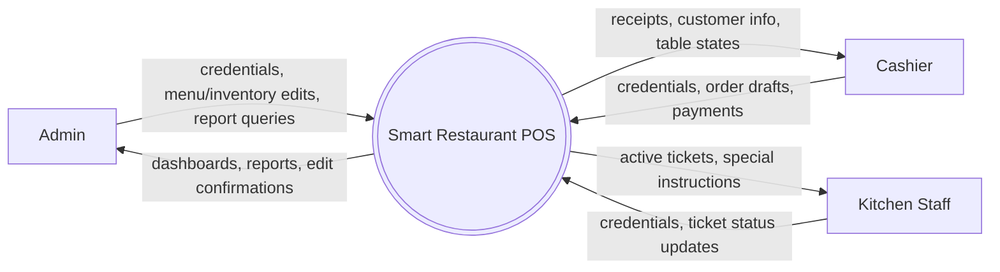
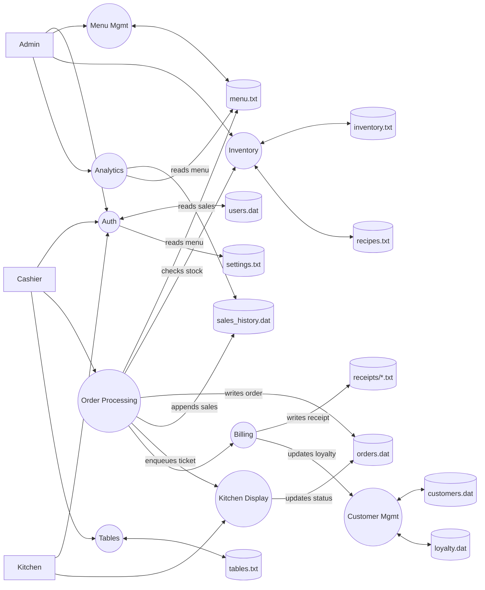
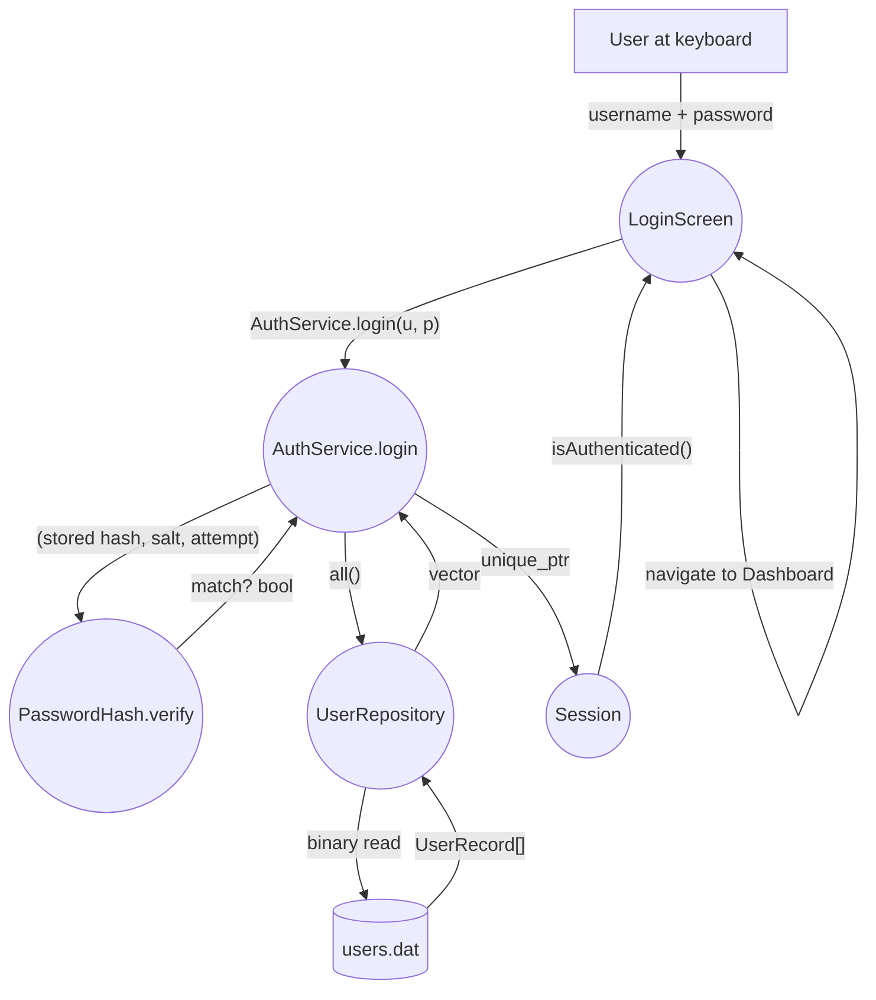
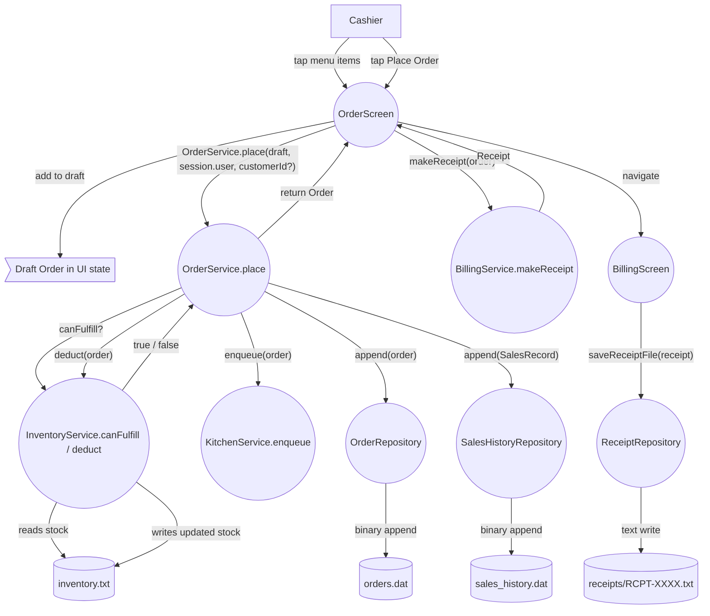
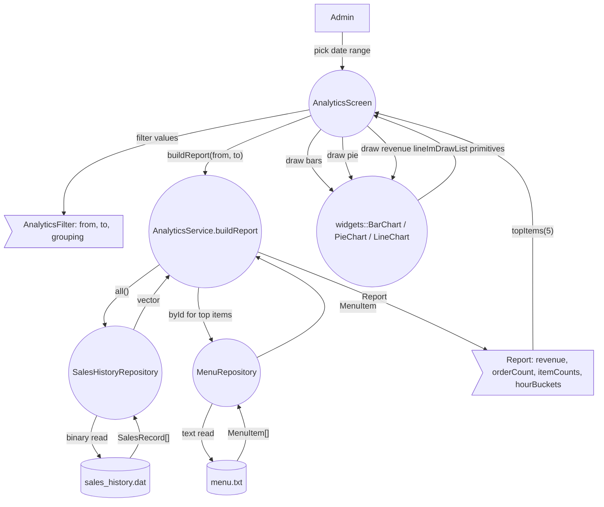
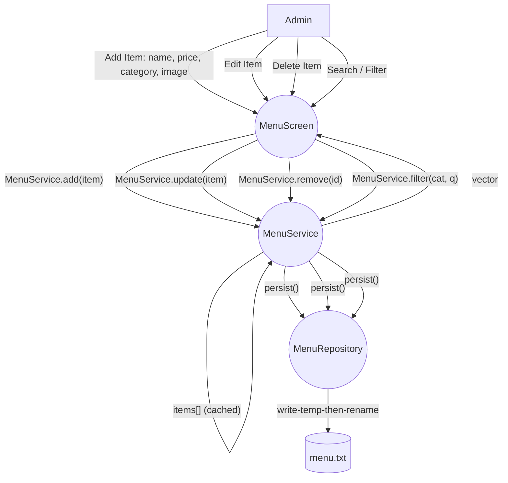
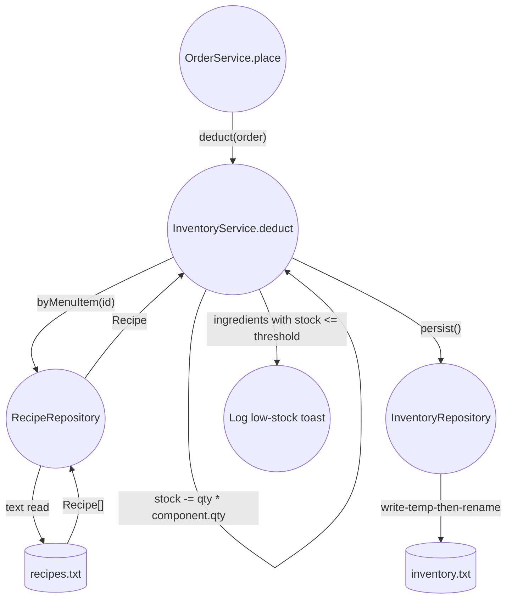
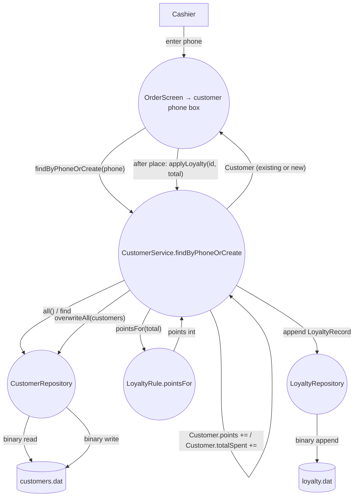
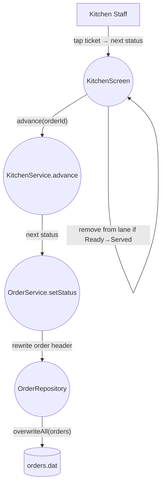

# 07 — Data Flow Diagrams (Mermaid)

> Phase 1 planning document. DFDs show how data moves between the UI layer, the
> domain layer, and the data files. Mermaid `flowchart LR/TD` is used because
> it lets us pick distinct node shapes per DFD element type:
>
> - `[external]` rectangle → **external entity** (the human at the keyboard).
> - `((process))` circle → **process** (a service method).
> - `[(data store)]` cylinder → **data store** (a file).
> - `>flow]` lozenge → **data flow label** when needed (rarely; arrows + labels usually suffice).
>
> Arrows are labelled with the data payload moving across that arrow.

---

## 1. Context-level (Level 0) — the whole system as one process

---

## 2. Level 1 — main subsystems

---

## 3. Level 2 — Login flow

Failure path: if `H` returns false, `A` throws `InvalidCredentialsException`. The
`UI` catches it and pushes a red `Toast`; `Session` stays cleared.

---

## 4. Level 2 — Place Order flow (the central use case)

Error paths (each pushes a toast):
- empty draft → `EmptyOrderException`
- `canFulfill` returns false → `InsufficientStockException` (with which ingredient)
- file write error → `FileIOException`

---

## 5. Level 2 — Generate Analytics Report flow

Note: charts are drawn **inside the same frame** the screen runs — there's no
intermediate file. The `Report` is held in transient UI state until the user
changes the filter.

---

## 6. Level 2 — Manage Menu (CRUD)

Why `persist()` after every mutation: the menu file is small, so we re-write the
whole file on each change. Crash-safety is the write-temp-then-rename pattern.

---

## 7. Level 2 — Inventory deduction (system-triggered)

---

## 8. Level 2 — Customer recognition & loyalty

---

## 9. Level 2 — Kitchen ticket advance

---

## 10. Cross-cutting: where files are touched (matrix)

| File | Read by | Written by |
|---|---|---|
| `users.dat` | `AuthService` | `AuthService` (addUser, password change) |
| `menu.txt` | `MenuService`, `OrderService` (resolve item names), `AnalyticsService` | `MenuService.persist` |
| `inventory.txt` | `InventoryService.canFulfill`, dashboard low-stock | `InventoryService.deduct`, `InventoryService.adjust` |
| `recipes.txt` | `InventoryService.deduct` | `InventoryService` (recipe editor — optional) |
| `orders.dat` | `OrderService.active/byId`, `AnalyticsService` (joins via id) | `OrderService.place / setStatus / cancel` |
| `receipts/*.txt` | nothing (write-only artifact) | `BillingService.saveReceiptFile` |
| `customers.dat` | `CustomerService` | `CustomerService.persist` |
| `loyalty.dat` | `AnalyticsService` (optional), `CustomerService.history` | `CustomerService.applyLoyalty` |
| `tables.txt` | `TableService.all` | `TableService.reserve/occupy/free` |
| `sales_history.dat` | `AnalyticsService.buildReport` | `OrderService.place` |
| `settings.txt` | `App` on boot, `Theme.apply` | `SettingsRepository.put` |
| `log.txt` | nothing | `util::Log` |

---

*End of `07-data-flow.md`.*
